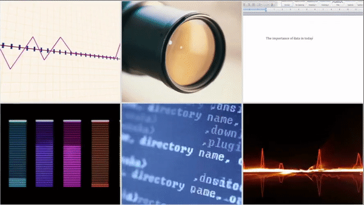
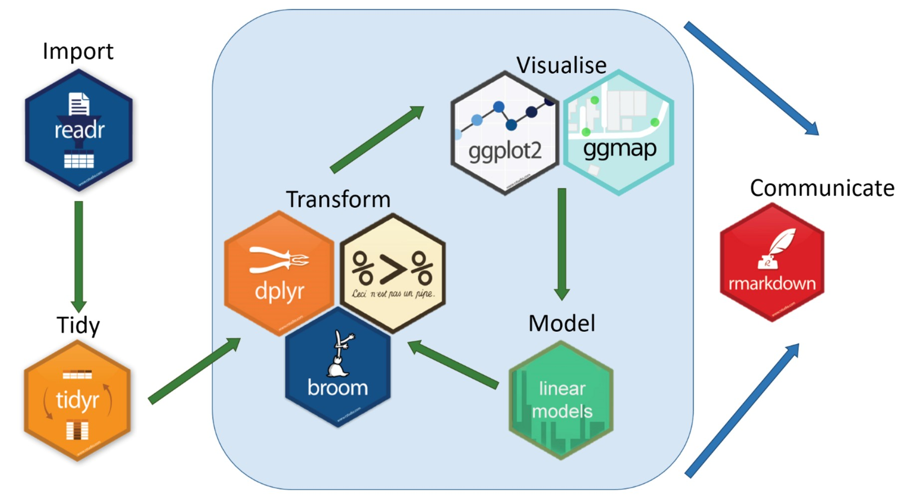
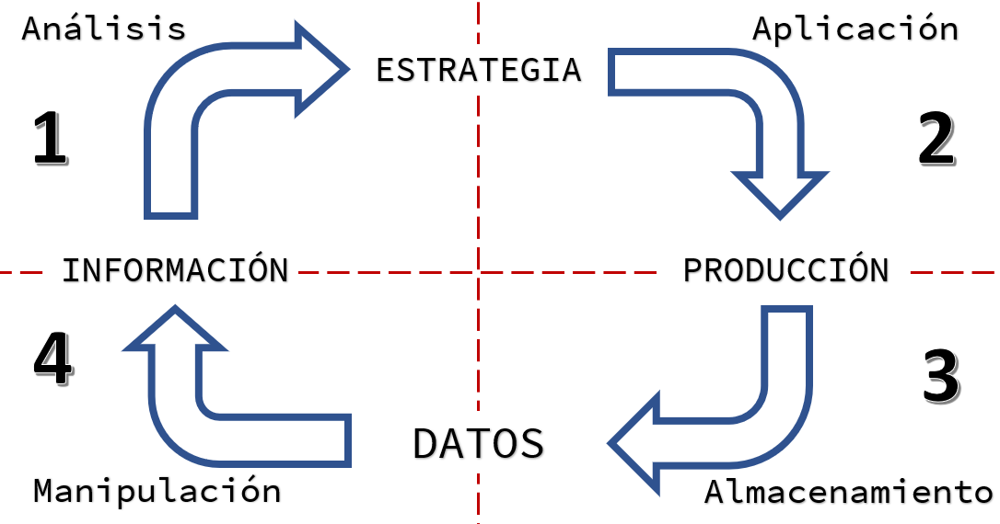
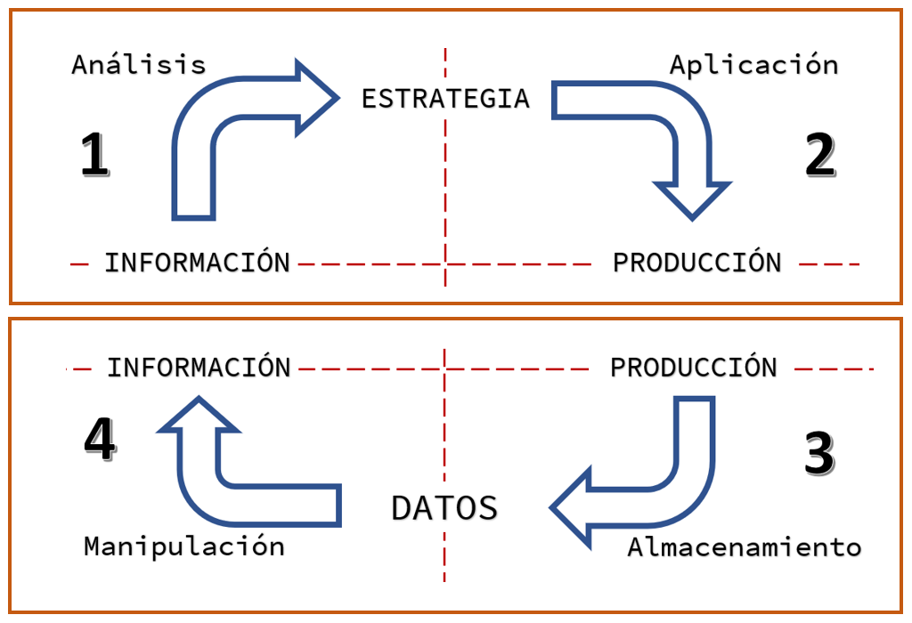
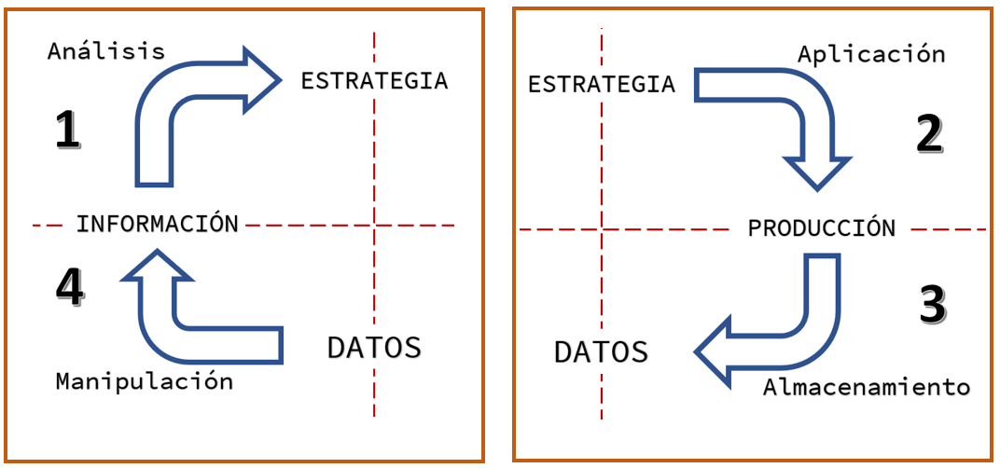
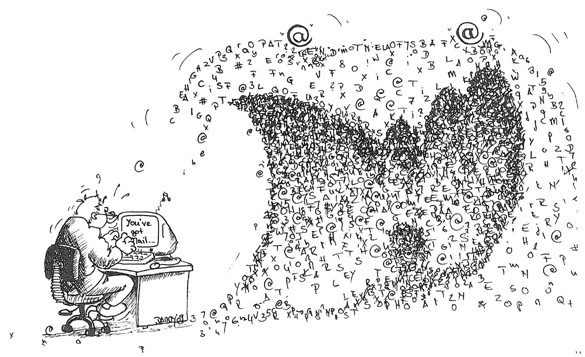
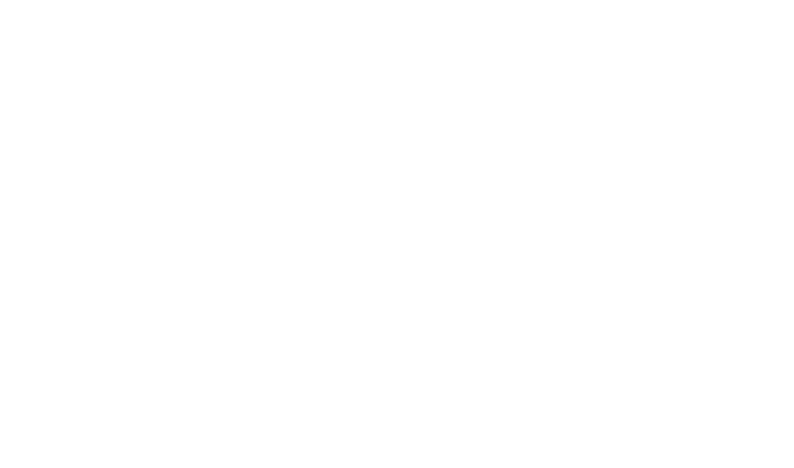
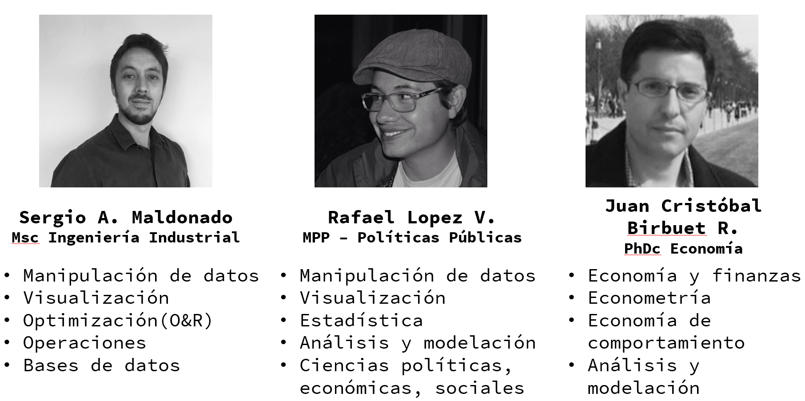

```{r setup, include=FALSE}
knitr::opts_chunk$set(echo = FALSE)

library(tidyverse)
library(quantmod)
library(highcharter)

```


background-image: url("img/cover1.png"), url("img/cover1.png"), url("img/ggplotC_logo.png")
background-size: 50%, 50%, 25%
background-position: -10% -10%, 110% 100%, 55% 60%


<center><b><h1>Data Science y la Industria</h1></b></center>

<center><b><h2>Aplicaciones y beneficios</h2></b></center>


<br><br>
<br><br>


<center><b><h3>Bolivia - Octubre 2020</h3></b></center>

<center><b style="font-size:150%; font-family:Source Code Pro;">Sergio A. Maldonado</b><br>
<b style="font-size:100%; font-family:Source Code Pro;"> MSc Ingeniería Industrial</b></center>

---

<!-- background-image: url("img/abstract1.jpg") -->
<!-- background-size: 100% -->
<!-- background-position: 0% 300% -->
background-image: url("img/abstract4.jpg")
background-size: cover


<center><b><h3>4ta Revolución industrial</h3></b></center></b></gral></center>


<center><gral><b>Integración de lo físico, digital y biológico
<center></center>

<!-- <center><b><h4 style="font-family:Source Code Pro;">Integración/fusión de lo físico, digital y biológico</center></h4></b> -->

<center><gral><b>
- Inteligencia Artificial<br>
- Machine Learning<br>
- Deep Learning<br>
- IoT<br>
- Big Data
</b></gral></center>


---

background-image: url("img/abstract1.jpg")
background-size: 100%
background-position: 0% 300%


<center><b><h3>DATOS Y BIG DATA</h3></b></center>


<iframe frameBorder="0" src="muestras/data_size.html" width="50%" height="60%" allowtransparency="true"></iframe><iframe frameBorder="0" src="muestras/market_bigdata.html" width="50%" height="60%" allowtransparency="true"></iframe>

---

background-image: url("img/abstract6.jpg")
background-size: 75%
background-position: 50% 50%

<center><b><h1>Big Data</h1></b></center>

<br><br><br>
<br><br><br>
<br><br><br>
<br><br><br>
<center><b><h4 style="font-family:Source Code Pro;">Volumen - Velocidad - Variedad - Veracidad</h4></b></center>


---


background-image: url("img/abstract4.jpg")
background-size: cover

<center><b><h1>Valor de Big Data</h1></b></center>
<center><b><gral style="font-size:30px">Data -> Información -> Valor</gral></b></center><br>
<center></center>


<center><b><gral>
- Ventaja competitiva <br>
- Manejo, análisis y tecnologías <br>
- Transformación de datos a valor de negocio<br>
</gral></b></center>


---
background-image: url("img/abstract2.jpg")
background-size: 100%
background-position: 50% 210%


<center><b><h2 style="font-family:Source Code Pro;">Datos del Negocio<br> Negocio de Datos</h2></b></center>


<br>
<center><h3>
1. Toma de decisiones<br>
2. Mejora en operaciones<br>
3. Monetización de datos
</h3></center>


---

background-image: url("img/abstract4.jpg")
background-size: cover
<center><b><h2 style="font-family:Source Code Pro;">Toma de decisiones</h2></b></center>

<center></center>
<br>
<center><gral><b>
- Mayores percepciones de mercado y clientes<br>
- Decisiones de diseño a venta<br>
- Análisis predictivo, proyección demanda<br>
- Manejo de inventario y precios
</b></gral></center>

---
background-image: url("img/abstract4.jpg")
background-size: cover
<center><b><h2 style="font-family:Source Code Pro;">Mejora en operaciones</h2></b></center>


<center></center>
<br>
<center><gral><b>
- Eficiencia, rendimiento, desempeño<br>
- Minimizar desperdicios<br>
- IoT y los sensores<br>
</b></gral></center>

---
background-image: url("img/abstract4.jpg")
background-size: cover
<center><b><h2 style="font-family:Source Code Pro;">Monetización de datos</h2></b></center>


<center></center>
<br>
<center><gral><b>
- Generar Big Data en productos<br>
- Datos como línea de negocio<br>
- Patrones para cultivos<br>
</b></gral></center>


---

<center><b><h2>Herramientas y paquetes </h3></b></center>

[<center>](https://www.microsoft.com/en/microsoft-365/excel)

[<center>](https://www.sas.com/en_gb/company-information.html)
[](https://www.ibm.com/analytics/spss-statistics-software)
[](https://www.stata.com/)

[](https://powerbi.microsoft.com/en-us/what-is-power-bi/)
[](https://www.tableau.com/en-gb/why-tableau/what-is-tableau)

[](https://www.r-project.org/about.html)
[</center>](https://www.python.org/about/)


---
background-image:  url("img/Data-Science-fields.png")
background-size:  46%
background-position: 50% 69% 

<center><b><h3>Ciencia de Datos "Data Science"</h3></b></center>

<center>Área interdisciplinaria que utiliza método científico, procesos, algoritmos y sistemas para extraer <b>entendimiento</b>,<b> conocimiento</b> y<b> percepciones</b> de diversos <b>datos</b> estructurados y no estructurados.</center>

<br><br><br>
<br><br><br>
<br><br><br>
<br><br>

<h3><center><b>¿CDO - Gerente de Datos?</b></center></h3>

---

background-image:  url("img/ggplotC_logo.png"), url("img/r_studio.png")
background-size:  25%, 30%
background-position: 5% 0%, 95% 5% 


<br><br><br>

<center>“La tecnología para acumular data excede nuestras habilidades para hacer uso de esta. RStudio ayuda al mundo en darle sentido a los datos”</center>

- Es un ecosistema de desarrollo integrado que ofrece herramientas gratuitas y de código abierto en R.

Misión **R**Studio:

- Crear software gratuito y libre para ciencia de datos, investigación científica y comunicación técnica. <br>
- Mejorar la producción y consumo de conocimiento, sin importar el poder económico. 


---

<center><b><h2 style="font-family:Source Code Pro;">Aplicación de Data Sicence</h2></b></center>


<center>

</center>


---


<center><b><h2>Ejemplo Twitter </h2></b></center>


---

<iframe frameBorder="0" src="https://rafalopezv.github.io/tweets/" width="100%" height=600 allowtransparency="true" allowfullscreen></iframe>

---

background-image: url("img/madein_bolivia.jpg")
background-size: 45%
background-position: 100% 70%

<center><b><h2>...pero, ¿qué sucede con nuestro entorno?</h2></b></center>

Diversos negocios en diferentes rubros, desde Startups hasta grandes corporaciones

1. Objetivos/propósitos
  - Impacto
  - Estabilidad
  - Ganancias
  - Competitividad/escalabilidad
2. Reinventarse y adaptarse continuamente<br>
ESTRATEGIA

3. Todos constantemente generan mucha...


---

background-image: url("img/abstract4.jpg")
background-size: cover


.center[

]


---

<center><b><h3>Naturaleza de los negocios/proyectos </h3></b></center>




---

<center><b><h3>Estrategia Vs Datos</h3></b></center>



---

<center><b><h3>Estrategia de Datos</h3></b></center>

<br><br>


---

<br>



<center>“Las familias felices son similares, pero toda familia infeliz es infeliz a su propia manera.” – Leo Tostoy </center>
<br>
<center>“Los datasets ordenados son similares, pero todo dataset desordenado es desordenado a su propia manera” – Hadley Wickham </center>


---

class: p
background-image: url("img/hc.gif")
background-size: cover

<br>
<center></center>
<br>
<center><b><h1 style="font-family:Source Code Pro;"> "Data Science" </h1></b></center>

---


background-image: url("img/ggplotC_logo.png")
background-size: 35%
background-position: 0% 0%

<br><br>
<br><br>
<center><h3>Propuesta ggPlot Consulting</h3></center>


Soluciones y tecnología de software gratuito y de código abierto para darle sentido y maximizar el valor de los datos.

Las estrategias deben basarse en datos:<br>
Creemos que las personas responsables de tomar decisiones y desarrollar estrategias, deben enfocarse en eso, sin gastar tiempo ni recursos en tareas innecesarias.

Gerente de Datos puede ser un líder ejecutivo que cuente con las herramientas y asesoramiento correcto.

---

background-image: url("img/abstract3.jpg"), url("img/ggplotC_logo.png")
background-size: 35%, 25%
background-position: 100% 20%, 3% 3%


<center><b><h2>Soluciones ggPlot</h2></b></center>

1. Automatizar la personalización (valor de Datos)

  - Integración, manipulación y estandarización de <br>datos y su estructura
  -	Visualización y comunicación de datos <br>(reportes, presentaciones, paneles de control)

2. Almacenamiento y manejo de la información
  - Asesoramiento en diseño y estructura de almacenamiento
  - Integración de datos y manejo en tiempo real

3. Estrategia de Datos 
  - Análisis de datos y el negocio
  - Desarrollo e implementación de modelos, simulaciones y proyectos
  - Desarrollo de estrategia de datos y toma de decisiones

---

<center><h2>Equipo profesional</h2></center>
<br>



---


<center><gral style="font-size:150%">Experiencia</gral></center>

<center>


&nbsp;&nbsp;&nbsp;


&nbsp;

&nbsp;&nbsp;&nbsp;


&nbsp;&nbsp;&nbsp;&nbsp;&nbsp;&nbsp;&nbsp;
&nbsp;&nbsp;&nbsp;&nbsp;&nbsp;&nbsp;&nbsp;


&nbsp;&nbsp;&nbsp;&nbsp;&nbsp;&nbsp;&nbsp;
<br>

&nbsp;&nbsp;&nbsp;&nbsp;&nbsp;&nbsp;&nbsp;

&nbsp;&nbsp;&nbsp;


</center>


---


background-image: url("img/ggplotC_logo.png"),url("img/cover1.png"), url("img/cover1.png") 
background-size: 35%, 45%, 50%
background-position:  55% 30%, -10% -10%, 110% 100%

<br><br><br>
<br><br><br>
<br><br><br>


<center><b style="font-size:170%; font-family:Source Code Pro;">Sergio A. Maldonado</b><br>
<b style="font-size:150%; font-family:Source Code Pro;"> Tel: +591 767 66041</b><br>
<b style="font-size:150%; font-family:Source Code Pro;"> sergio.maldo@gmail.com</b></center><br>
